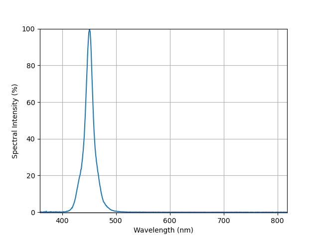

# Example for Measuring a Wavelength Spectrum Using the SpikeSafe PSMU and a Spectrometer

In this sequence, we will address how to integrate a SpikeSafe PSMU into a light measurement system. From there, we will demonstrate how to easily perform wavelength spectrum light measurements using the SpikeSafe's Single Pulse operation mode. 

## **Purpose**
Demonstrate how to integrate the SpikeSafe PRF or PSMU into a light measurement system and how to implement Single Pulse current operation to obtain a wavelength spectrum light measurement. This measurement conveys the amount of radiant power generated from an LED or laser across the electromagnetic spectrum throughout the wavelengths of the visible spectrum, as well as some adjacent wavelengths. It is a fundamental measurement in determining the operating characteristics of an LED or laser.

## Overview 
Operates SpikeSafe as a current source that outputs a single pulse. An Instrument Systems CAS4 spectrometer is implemented, which will take triggered light measurements synchronized with the SpikeSafe output trigger. See the test diagram below:

The SpikeSafe PSMU operates similarly to the [Run Single Pulse](../../RunSpikeSafeOperatingModes/RunSinglePulse) sequence. 

The CAS4 spectrometer is operated using external resources provided by Instrument Systems. To obtain the necessary resources to run this sequence, please visit [the Instrument Systems website](https://www.instrumentsystems.com/en/products/software/sdk-spectrometer/). After installing these resources on your computer, install the libraries listed in the **Considerations** section of this document. More information on CAS spectrometers can be found [here](https://www.instrumentsystems.com/en/products/spectrometers/).

## Key Settings 
The following settings are configured by default. At the top of the sequence, there are multiple lines corresponding to individual test parameters. These lines may be modified to match the necessary parameters for your specific LED or Laser.

### SpikeSafe Current Output Settings
- **Set Current:** 100mA
- **Compliance Voltage:** 20V
- **On Time:** 1s

### CAS Spectrometer Light Measurement Settings
- **Autoranging:** Off
- **Integration Time:** 20ms
- **Trigger Mode:** Hardware (i.e. Flip-Flop)
- **Trigger Delay:** 5ms

## Considerations
- This sequence involves graphing measurement results, and requires the [ScottPlot](https://swharden.com/scottplot/) library. See instructions on installing this library under the "Usage" section in the [Vektrex.SpikeSafe.CSharp.Samples markdown file](/README.md#installing-scottplot).
- External resources are needed to operate the CAS4 spectrometer. These can be obtained by Instrument Systems, and should install the following files:
    - C headers file: C:\Program Files\Instrument Systems\CAS4x64-SDK\VC2013\CAS4.h
    - CAS DLL: C:\Windows\System32\CAS4x64.dll
- The CAS4 spectrometer requires a configuration (.INI) file and calibration (.ISC) file to operate. Both of these files should be copied and pasted to the Vektrex.SpikeSafe.CSharp.Samples\ApplicationSpecificExamples\RunningLivSweeps folder before starting this sequence.
- In LIVSweepExample.py, modify the line `cas4InterfaceMode = 3` in order to specify the communication interface for the CAS4. The following communication interfaces are supported:
    - **1:** PCI
    - **3:** Demo (No hardware (Default))
    - **5:** USB
    - **10:** PCIe
    - **11:** Ethernet

## Expected Results
Upon starting the sequence, the user will be prompted to enter the names of the Instrument Systems configuration (.INI) file and calibration (.ISC) file that correspond to the test spectrometer. After initializing the spectrometer with the specified files, a single pulse will be outputted and light measurements will be automatically taken. Upon completion of the sequence, a graph of the wavelength spectrum will appear onscreen. This graph will display the percentage of the max radiant power of the DUT at each wavelength across the visible spectrum using ScottPlot. See the example below.

The results above were obtained using a SpikeSafe PSMU 5A in conjunction with a CAS 140D array spectroradiometer. The DUT was a cool blue LED with a forward current of 750mA. The default sequence settings were used for this testing.

