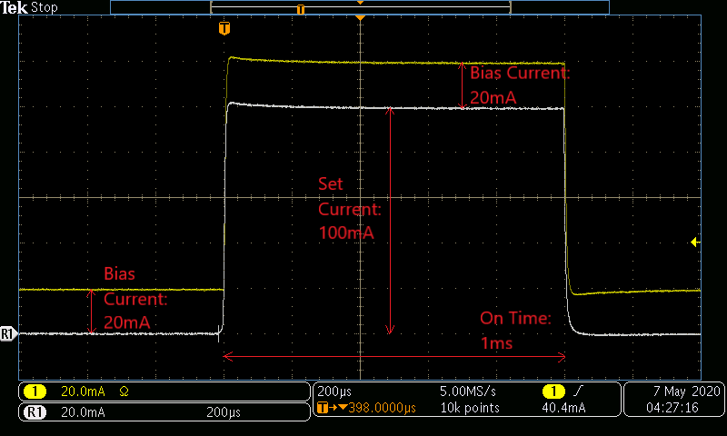
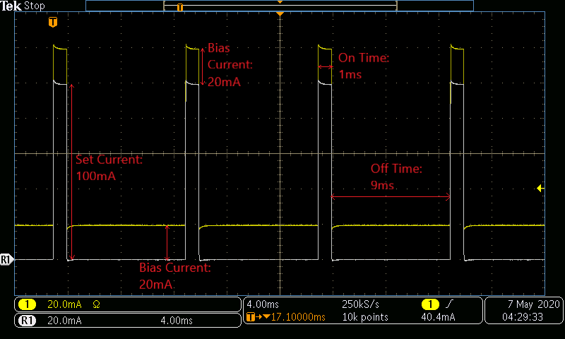
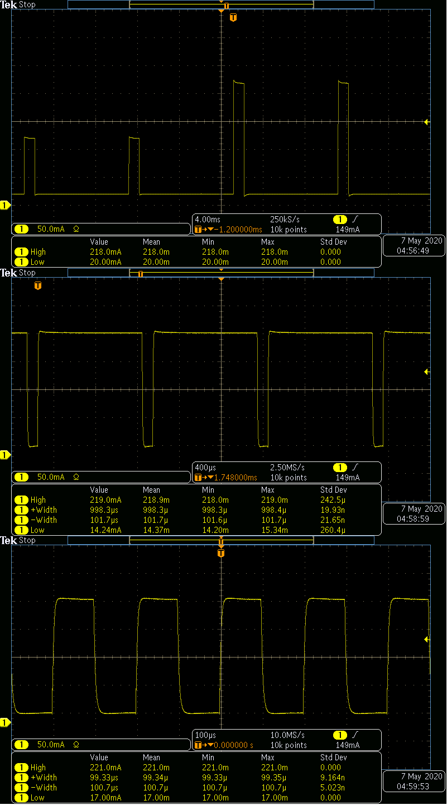

# Examples for Operating a SpikeSafe PRF or PSMU in Bias Pulsed modes

## **Purpose**
Demonstrate how to use a SpikeSafe PRF or PSMU to deliver high precision pulsed current to an LED or Laser while also delivering a constant low-amperage DC bias current. Continuous Bias and Continuous Dynamic Bias operation modes output a continuous current pulse train at the specified Set Current, Bias Current, On Time, and Off Time. These bias current modes incorporate a secondary low-current DC source that is useful when making junction temperature (Tj) measurements. The two modes differ in the way they start up, and the way they regulate current after startup.

These modes are similar to their corresponding [Pulsed Mode](../RunPulsed) in every aspect except for the always-on bias current that is outputted while a channel running a Bias Pulsed mode is enabled.

Vektrex recommends using Continuous Dynamic Bias Current (CDBC) for testing low currents below a few amps.  CDBC mode starts with no ramp; the current transitions from zero to the programmed value in microseconds. CDBC mode does not make adjustments to decrease internal power dissipation.

For long term testing over a few amps, Continuous Bias Current (CBC) mode is recommended. CBC mode makes internal adjustments to decrease power dissipation. For long term reliability testing this reduction in power will save energy and generate less heat. The small adjustments can introduce a very small current variation, usually less than 0.1% of programmed set current.

 When using these Bias modes for Tj measurements, CDBC mode is normally used and the bias source is programmed to a small fraction of the load device operating current. When the heating current then turns off (during the pulse off time) the small bias current continues to drive the load device. The load forward voltage can then be measured and compared with calibration voltage readings to determine the temperature of the load device. Bias Current only mode is normally used to generate the calibration voltage readings. More information about Tj measurement can be found at [JESD 51-51](https://www.jedec.org/sites/default/files/docs/JESD51-51.pdf) and [LEDs Magazine](https://www.ledsmagazine.com/manufacturing-services-testing/article/14173251/jedec-technique-simplifies-led-junction-temperature-measurement). 

## **Run Bias Pulsed Mode**

### Overview 
Operates SpikeSafe as a pulsed current source with a user-specified Pulse On Time and Pulse Off Time. During the On Times, the Set Current plus the Bias Current will be outputted. During the Off Times, only the Bias Current will be outputted

### Key Settings 
- **Set Current:** 100mA
- **Bias Current:** 20mA
- **Compliance Voltage:** 20V
- **On Time:** 1ms
- **Off Time:** 9ms
- **Ramp Rate:** Default. Voltage will ramp as fast as 10V/sec. Current will ramp as fast as 1A/sec.

### Considerations
- On Time and Off Time can be set using an alternative command set that consists of setting Duty Cycle, Period, and/or Pulse Width. A tutorial describing use of these alternative commands can be found in the [Using Pulse Holds](../../ApplicationSpecificExamples/UsingPulseHolds) folder.
- These sequences are run with the default compensation settings. This may not result in the ideal pulse shape for all test loads, in which case [Pulse Tuning](../../ApplicationSpecificExamples/PulseTuning) may be required. Pulse tuning is especially applicable during shorter Pulse On Times in the microsecond scale.

### Current Output
When running either sequence, one can expect to see the following current output and pulse shape. Note the difference between the waveform without a bias current (in white) and the waveform implementing a bias current (in yellow). This image was acquired by measuring output current using a TCPA300 Current Probe into a MDO3024 Mixed Domain Oscilloscope

**Pulse Shape**

**Continuous Pulse Train with Bias Current**

## **Run Bias Pulsed Dynamic Mode**

### Overview
Operates SpikeSafe as a pulsed current source with multiple output currents. In Continuous Dynamic mode, the Set Current, On Time, and Off Time can be modified while the SpikeSafe is outputting current.  

Set the Maximum Compliance Voltage (MCV) to the expected load voltage +5V. Reduce MCV if an internal over power error occurs. 

### Key Settings
- **Set Current:** 100mA initially. While the channel is operating, the Set Current will be dynamically changed to 200mA.
- **Bias Current:** 20mA. Bias Current cannot be modified while a channel is operating.
- **On Time:** 1ms initially. While the channel is operating, the On Time will be dynamically changed to 100µs.
- **Off Time:** 9ms initially. While the channel is operating, the Off Time will be dynamically changed to 100µs.
- **Compliance Voltage:** 20V
- **Ramp Rate:** Default. Voltage will ramp as fast as 10V/sec. Current will ramp as fast as 1A/sec.

### Current Output
One can expect to see the following current pulse train when running this Bias Pulsed Dynamic sequence. Note the changes in Set Current, On Time, and Off Time. This image was acquired by measuring output current using a TCPA300 Current Probe into a MDO3024 Mixed Domain Oscilloscope

